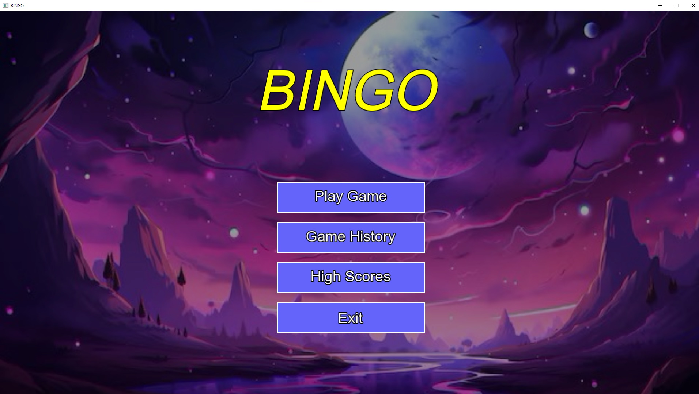
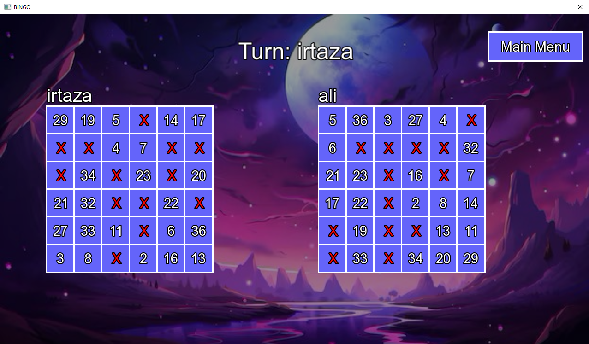
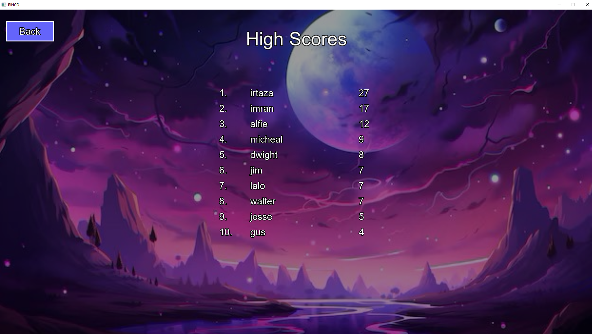

# 🎮 Bingo: SFML Edition (Semester Project)

A classic **Bingo** game developed in **C++** and brought to life using the **SFML multimedia library**. This project began as a console-based assignment for the *Programming Fundamentals* course and evolved into a fully-featured **graphical application** with music, UI elements, and persistent data.

---

## 📸 Screenshots


| Main Menu | Gameplay | High Scores |
|-----------|----------|-------------|
|  |  |  |

---

## 🧩 Features

- 🎨 **Graphical UI**: Built entirely with **SFML**, replacing the original console interface.
- 🧮 **Dynamic Board Size**: Play with board sizes ranging from **4x4 to 25x25**.
- 💾 **Save & Resume**: Automatically saves your progress. Resume any unfinished game later.
- 🏆 **Persistent High Scores**: Tracks top 10 scores in a local file.
- 📖 **Game History**: Stores the last **10 completed games** with player names and winner.
- 🔊 **Audio Feedback**: Background music and click sound effects enhance the experience.

---

## 📘 Project Evolution

### ▶️ Phase 1: Console Version
- Command-line based Bingo game
- Turn-based logic
- Basic file I/O for saving high scores
- Procedural structure

### 🎨 Phase 2: SFML Refactor
- Refactored to use **SFML** for graphics/audio
- Introduced **state machine** to manage screens
- Created reusable UI components (`Button`, `InputBox`, etc.)
- Enhanced with cleaner structure, and user input handling via mouse/keyboard

---

## 🧱 Technology Stack

| Component | Technology |
|----------|------------|
| Language | C++ (C++11 or newer recommended) |
| Graphics & Audio | [SFML 2.5.1+](https://www.sfml-dev.org/) |

---

## ⚙️ Getting Started

### ✅ Prerequisites

- A C++ compiler (GCC, Clang, or MSVC)
- SFML installed on your system ([Download Here](https://www.sfml-dev.org/download.php))

---

## 🛠️ Project Setup

### 🔗 SFML Linking
Ensure the following modules are linked:
- `sfml-graphics`
- `sfml-window`
- `sfml-system`
- `sfml-audio`

### 📂 Required Assets

Create a folder named `assets` in the same directory as your executable, and include:

| File | Purpose |
|------|---------|
| `arial.ttf` | Font |
| `bingo-music.mp3` | Background music |
| `button-click.mp3` | Sound effect for button clicks |

### 📄 Required Data Files
Ensure the following files exist in the project root (created/managed automatically):
- `SaveGame.txt`
- `HighScore.txt`
- `GameHistory.txt`

---

## 🧪 Build Instructions

Using a compiler:
```bash
g++ -std=c++11 main.cpp -o BingoApp -lsfml-graphics -lsfml-window -lsfml-system -lsfml-audio
./BingoApp
Or configure via an IDE (Visual Studio, Code::Blocks) ensuring SFML paths and dependencies are correctly linked.

🎮 How to Play
Launch the game – the main menu appears.

Click "Play Game":

Enter player names.

Choose board size (4x4 to 25x25).

During gameplay:

Players take turns clicking numbers.

Each number is crossed off on both boards.

Win Condition: First to complete 5 lines (rows, columns, or diagonals).

Click Exit Game to safely save progress and return to the menu.


👤 Author
Irtaza Shahzad

Developed as part of the Programming Fundamentals course with a passion for gaming and elegant C++ design.
